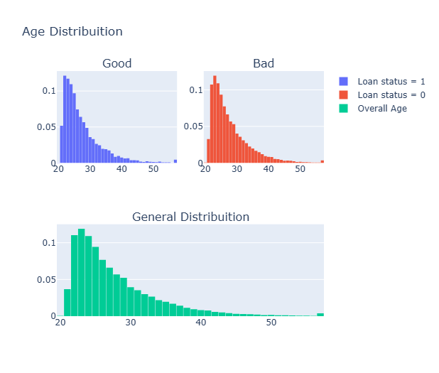

# Home Credit Risk Modeling

A credit risk modeling project using supervised machine learning to identify high-risk loan applicants in a real-world, imbalanced dataset.

## Overview
- **Task:** Binary classification (default vs non-default)
- **Data:** ~28.5K loan applications with borrower and credit features
- **Challenge:** Severe class imbalance
- **Focus:** Preprocessing and fair model comparison

## Approach
- Cleaned and encoded numerical and categorical features
- Removed constant and highly correlated variables
- Applied IQR-based outlier capping
- Addressed imbalance with **Borderline-SMOTE**
- Trained and compared multiple classifiers

## Models
- Logistic Regression  
- Random Forest  
- LightGBM  
- CatBoost  

## Evaluation
- Accuracy
- Precision / Recall
- F1-score
- ROC–AUC
- Confusion Matrix

## Results
- Trained and evaluated models on ~28,500 loan applications with strong class imbalance.
- Gradient-boosted models (CatBoost and LightGBM) performed best, reaching **ROC–AUC ≈ 0.87–0.89** and **test accuracy ≈ 94–95%**.
- Using **Borderline-SMOTE** improved recall for defaulted loans by about **20–25 percentage points** compared to models trained on the original data.
- Final models achieved **balanced precision and recall**, with **F1-scores above 0.80** for the default class.
- Feature reduction and correlation filtering helped reduce overfitting and improved generalization.

## Why It Matters
Demonstrates my ability to build **realistic credit risk models**, handle imbalanced financial data, and evaluate classifiers using relevant metrics.

---
## Quick Visuals

### Feature Importance
Key drivers of loan default risk identified by the final model.  

---

### Feature Correlation
Correlation heatmap used to identify redundant variables and guide feature reduction.

---

### Home Ownership vs Default
Distribution of loan default outcomes across different home ownership categories.

---

### Age Distribution by Loan Status
Age distributions for defaulted loans, non-defaulted loans, and the overall applicant population.

---

## Contact
**Tajiana Pickett** · 📧 Tajianap@gmail.com
